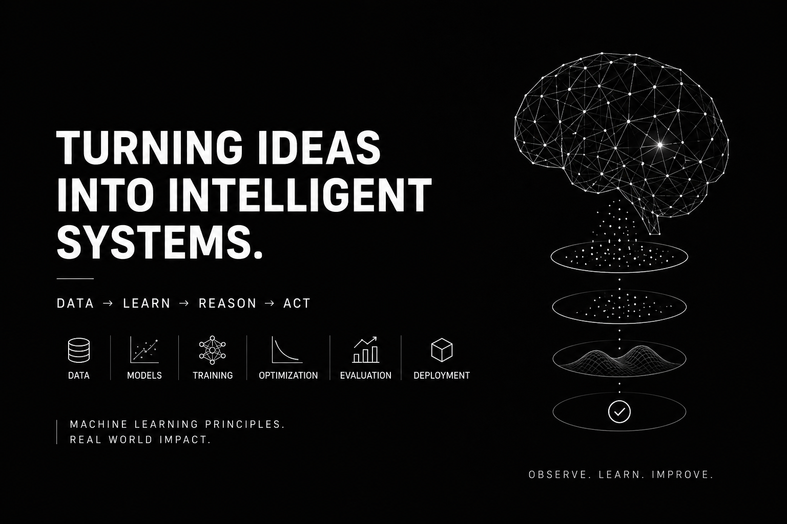

<h1 align="center">
  
</h1>

<h3 align="center">
AI Engineer • Machine Learning Researcher • Reinforcement Learning & Multi-Agent Systems Researcher
</h3>

<p align="center">
Building intelligent systems that learn, reason, adapt, and collaborate.
</p>

<p align="center">

</p>

<p align="center">


</p>

<p align="center">
  
</p>

---

#  About Me

```python
class GarimaKumari:

    role = [
        "AI Engineer",
        "Machine Learning Researcher",
        "RL & Multi-Agent Systems Researcher"
    ]

    interests = [
        "Large Language Models",
        "Retrieval-Augmented Generation",
        "AI Agents",
        "Reinforcement Learning",
        "Multi-Agent Coordination",
        "NLP",
        "Production AI Systems"
    ]

    currently_building = [
        "Enterprise AI Workflow Systems",
        "Multi-Agent AI Applications",
        "Production RAG Systems",
        "Real-Time AI Voice Intelligence",
        "RLHF & Self-Improving QA Systems"
    ]

    mission = "Build AI systems that learn, adapt, reason and collaborate."
```

---

#  Research Interests

- 🧠 Large Language Models
- 🤖 AI Agents & Autonomous Systems
- 🎯 Reinforcement Learning
- 🤝 Multi-Agent Systems
- 📚 Natural Language Processing
- 🔬 Representation Learning
- ⚡ AI Evaluation & Alignment
- 🌍 Responsible & Scalable AI

---

#  AI Engineering

### Production AI

- 🤖 Multi-Agent AI Systems
- 📚 Production RAG Pipelines
- 🧠 LLM Orchestration
- 🔄 AI Workflow Automation
- ⚙️ AI APIs & Backend Systems
- 📈 Model Evaluation & Monitoring

### Machine Learning

- PyTorch
- Deep Learning
- NLP
- Reinforcement Learning
- RLHF
- Fine-Tuning
- Embeddings

---

#  Tech Stack

### Languages

<p>

</p>

### AI / ML

<p>

</p>

**Also Working With**

- Transformers
- RAG
- RLHF
- AI Agents
- LLM Evaluation
- Multi-Agent Systems

### Backend

<p>

</p>

### Frontend

<p>

</p>

### Database

<p>

</p>

### Dev Tools

<p>

</p>

---

#  Currently Building

- 🚀 Enterprise Multi-Agent AI Systems
- 📚 Production Research Assistant (RAG)
- 🤖 AI Workflow Orchestration
- 🎤 Real-Time AI Voice Intelligence
- 🧠 RLHF Self-Improving Question Answering

---

#  What Drives Me

I enjoy building AI systems that combine:

- 🧠 Reasoning
- 📚 Retrieval
- 🤖 Autonomous Agents
- 🎯 Reinforcement Learning
- 🤝 Multi-Agent Collaboration
- ⚡ Production Engineering

I believe the future of AI lies in **intelligent systems capable of learning, reasoning, collaborating, and continuously improving in real-world environments.**

---

#  GitHub Stats

<p align="center">


</p>

<p align="center">

</p>

---

#  Contribution Graph

<p align="center">


</p>

---

#  Connect With Me

<p align="center">

<a href="https://www.linkedin.com/in/garima-singh-4122331bb/">

</a>

<a href="mailto:garimakumari265@gmail.com">

</a>

</p>

<p align="center">
📧 <strong>garimakumari265@gmail.com</strong>
</p>

---

<h3 align="center">


</h3>
