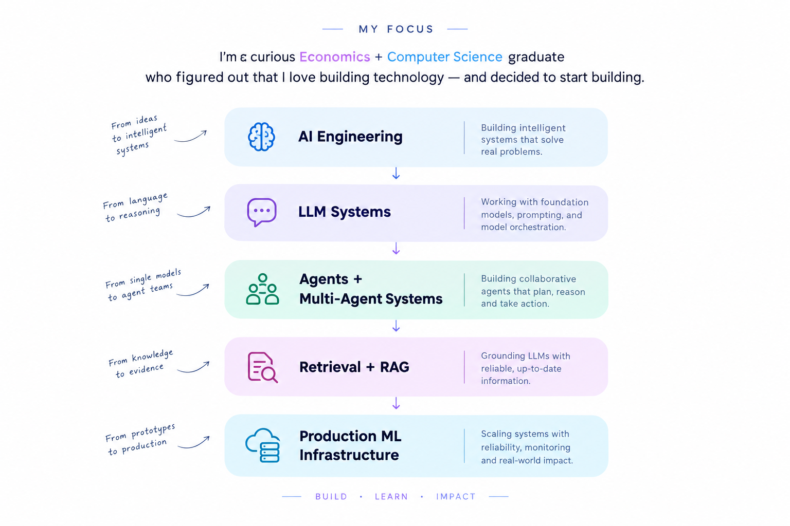

<div align="center">

<!-- =========================
     HERO
========================= -->

<a href="https://orion-ai-henna.vercel.app/">
 
</a>

<br/>


<br/>

<h3>AI Engineer · ML Researcher · Builder</h3>

<p>
  I build production AI systems around
  <b>agents</b>, <b>RAG</b>, <b>LLM systems</b>,
  and <b>multi-agent architectures</b>.
</p>

<br/>

<a href="https://portfolio-pi-nine-go9srckad3.vercel.app/">
  
</a>
&nbsp;
<a href="https://github.com/garimakumari44">
  
</a>
&nbsp;
<a href="https://www.linkedin.com/">
  
</a>

<br/><br/>


</div>

<br/>

<!-- =========================
     ABOUT
========================= -->

# `01` — ABOUT

> **Exploring the space between intelligence and engineering.**

I'm an **AI Engineer** interested in the intersection of:

```text
Machine Learning
        ↓
Intelligent Systems
        ↓
AI Agents + LLM Systems
        ↓
Retrieval + Reasoning
        ↓
Production Infrastructure
```

I enjoy going beyond model calls.

The interesting part, for me, is designing the **system around the model**:

`retrieval` · `orchestration` · `agents` · `evaluation` · `infrastructure`

I learn by:

```text
BUILD
  ↓
BREAK
  ↓
MEASURE
  ↓
UNDERSTAND
  ↓
REBUILD
```

---

<!-- =========================
     FOCUS IMAGE
========================= -->

# `02` — MY FOCUS

<p align="center">
  
</p>

---

# `03` — SYSTEMS I'VE BUILT

> Three systems.
> Three different ways of exploring intelligence.

<br/>

## ◉ ORION

### Multi-Agent AI for Equity Research

**A production-oriented multi-agent AI analyst system built to research companies and markets.**

Orion decomposes a research request into structured tasks and coordinates specialized analysts through an execution workflow.

```text
Research Request
      ↓
Intent Analysis
      ↓
Adaptive Planner
      ↓
Task Decomposition
      ↓
Execution DAG
      ↓
Specialized Analysts
      ↓
Evidence
      ↓
Investment Committee
      ↓
Critic
      ↓
Research Report
```

### Intelligence Layer

`Company`

`Financial`

`Industry`

`News`

`Macro`

`Valuation`

`Risk`

`Evidence`

`Investment Committee`

`Critic`

### Engineering Principles

* LLMs provide reasoning and synthesis
* Deterministic services provide calculations and data
* Tools provide access to external information
* Shared research context prevents uncontrolled agent coupling
* Evidence is preserved throughout the workflow
* Execution is observable and failure-aware
* The LLM is **not the workflow controller**

**↗ Live System**

https://orion-ai-henna.vercel.app/

**↗ Source Code**

https://github.com/garimakumari44/Orion_AI_System

<br/>

---

## ◉ ENTERPRISE AI

### Document Intelligence & AI Workflow Orchestration

**An AI platform for transforming unstructured business documents into intelligence and automated workflows.**

The system explores how document understanding, retrieval, LLM reasoning, and workflow orchestration can work together inside a production-oriented backend.

```text
Documents
    ↓
Ingestion
    ↓
Extraction
    ↓
Understanding
    ↓
Retrieval
    ↓
AI Workflow
    ↓
Reasoning
    ↓
Structured Intelligence
```

### Core Areas

`Document Intelligence`

`Information Extraction`

`Retrieval`

`LLM Workflows`

`Backend Orchestration`

`Production Infrastructure`

The goal is not simply to ask an LLM questions about documents.

It is to build the **system that turns documents into usable intelligence**.

**↗ Live System**

*Add deployment link*

**↗ Source Code**

*Add repository link*

<br/>

---

## ◉ AI RESEARCH ASSISTANT

### Research Intelligence for AI Papers

**A production-oriented research intelligence system for searching, retrieving, and reasoning over AI research papers.**

The system treats retrieval as an engineering problem rather than simply embedding documents and calling an LLM.

```text
Research Question
      ↓
Query Analysis
      ↓
Query Rewriting
      ↓
Retrieval
      ↓
Reranking
      ↓
Evidence Assembly
      ↓
Grounded Generation
```

### Retrieval Stack

`Dense Retrieval`

`BM25`

`RRF`

`Cross-Encoder`

`FAISS`

`Metadata Filtering`

`Adaptive RAG`

`Evidence Grounding`

### Core Principle

> **Retrieval should produce reliable evidence before generation produces an answer.**

The system is designed around:

* evidence-first retrieval
* hybrid search
* adaptive retrieval strategies
* provenance
* research graphs
* evaluation
* grounded generation

**↗ Live System**

*Add deployment link*

**↗ Source Code**

*Add repository link*

<br/>

---

# `04` — THE AI LAYER

<p align="center">

```text
                         ┌─────────────────────┐
                         │     INTELLIGENCE    │
                         └──────────┬──────────┘
                                    │
              ┌─────────────────────┼─────────────────────┐
              ↓                     ↓                     ↓
        ┌───────────┐         ┌───────────┐         ┌───────────┐
        │  AGENTS   │         │ RETRIEVAL │         │ LEARNING  │
        └─────┬─────┘         └─────┬─────┘         └─────┬─────┘
              │                     │                     │
              └─────────────────────┼─────────────────────┘
                                    ↓
                         ┌─────────────────────┐
                         │  SYSTEMS ENGINEERING│
                         └─────────────────────┘
```

</p>

---

# `05` — WHAT I'M EXPLORING

### 🤖 AGENTS

Systems that can:

```text
reason
  ↓
plan
  ↓
use tools
  ↓
observe
  ↓
act
```

I'm interested in architectures where agents are not simply chat interfaces, but components inside larger deterministic systems.

---

### 🧠 LEARNING

Systems that improve through:

`feedback`

`evaluation`

`interaction`

`experience`

`optimization`

I'm particularly interested in the intersection of modern AI systems with **reinforcement learning and decision-making**.

---

### ◇ COORDINATION

Multiple intelligent systems working together.

The interesting question isn't only:

> **Can an agent reason?**

It's also:

> **How should intelligent components coordinate?**

This leads into:

`Multi-Agent Systems`

`Planning`

`Task Decomposition`

`Execution Graphs`

`Shared Context`

`Tool Use`

`Criticism`

`Verification`

---

# `06` — THE DIRECTION

I'm interested in **applied AI / ML systems** where research meets production engineering.

The areas I'm currently exploring include:

```text
AI Agents
LLM Systems
Retrieval Engineering
Adaptive RAG
Multi-Agent Systems
ML Infrastructure
Evaluation
Research Engineering
Reinforcement Learning
Decision Intelligence
```

The direction is toward systems that can:

```text
REASON
   ↓
RETRIEVE
   ↓
USE TOOLS
   ↓
COLLABORATE
   ↓
LEARN
   ↓
IMPROVE
```

Not just systems that generate text.

Systems that can **do things**.

---

# `07` — ENGINEERING PHILOSOPHY

### 01 — EVIDENCE BEFORE GENERATION

Reliable systems need reliable information.

```text
Retrieve
   ↓
Verify
   ↓
Assemble Evidence
   ↓
Generate
```

---

### 02 — LLMs ARE COMPONENTS

An LLM should not automatically become the entire architecture.

I prefer separating:

```text
Reasoning
Data
Tools
Control
State
Execution
Evaluation
```

---

### 03 — SYSTEMS OVER PROMPTS

Prompt engineering matters.

But production AI requires much more:

`architecture`

`retrieval`

`orchestration`

`observability`

`evaluation`

`failure handling`

---

### 04 — MEASURE THE SYSTEM

A system isn't production-ready because it works once.

I care about:

```text
Accuracy
Precision
Recall
Grounding
Faithfulness
Latency
Reliability
Failure Modes
Cost
```

---

# `08` — TECHNOLOGY UNIVERSE

<div align="center">

### AI / ML


<br/><br/>

### AI Systems


<br/><br/>

### Frontend


<br/><br/>

### Infrastructure & Tools


</div>

---

# `09` — CURRENT RESEARCH MAP

```text
                         AI SYSTEMS
                              │
              ┌───────────────┼───────────────┐
              │               │               │
              ↓               ↓               ↓
          RETRIEVAL        AGENTS          LEARNING
              │               │               │
              ↓               ↓               ↓
        Adaptive RAG      Planning        Reinforcement
              │               │           Learning
              ↓               ↓               │
         Evidence        Multi-Agent         ↓
         Grounding        Systems        Decision Making
              │               │               │
              └───────────────┼───────────────┘
                              ↓
                    PRODUCTION AI SYSTEMS
```

---

# `10` — BUILDING IN PUBLIC

I like documenting the engineering behind the systems I build:

```text
Architecture
   ↓
Implementation
   ↓
Experiments
   ↓
Benchmarks
   ↓
Failures
   ↓
Lessons
```

The goal isn't to make every project look perfect.

The goal is to understand **why the system works — and why it fails**.

---

# `11` — BEYOND THE PROJECTS

<div align="center">

### Build something.

### Break something.

### Understand why.

### Build it better.

<br/>

```text
┌──────────────────────────────────────────────┐
│                                              │
│        BUILD  ·  LEARN  ·  EXPLORE           │
│                                              │
└──────────────────────────────────────────────┘
```

</div>

---

# `12` — CONNECT

<div align="center">

<a href="https://portfolio-pi-nine-go9srckad3.vercel.app/">
  
</a>

<a href="https://github.com/garimakumari44">
  
</a>

<a href="https://www.linkedin.com/">
  
</a>

<br/><br/>

**AI Engineering · ML Research · Intelligent Systems**

<br/>


</div>
